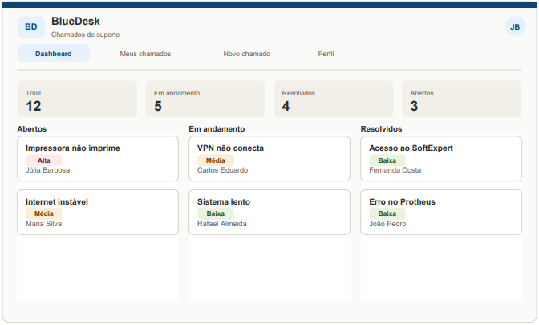
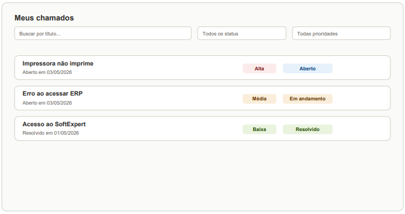

# BLUEDESK_GESTAO_CHAMADOS
> Sistema de gerenciamento de chamados de suporte técnico desenvolvido com Python, SQLite e JavaScript, permitindo abertura, acompanhamento e aprovação de chamados entre diferentes setores de uma empresa.

## Mockup

🔗 **Deploy ao vivo:** em desenvolvimento

## Funcionalidades
- Cadastro e autenticação de usuários por setor (T.I, RH, Compras, Financeiro, Fiscal, Cliente).
- Abertura de chamados com categoria, prioridade e setor responsável.
- Listagem de chamados com filtros por status, prioridade e solicitante.
- Fluxo de aprovação para chamados de acesso/permissão, com revisão do time de T.I.
- Histórico de interações (comentários) por chamado.
- Dashboard com contadores por status.
- API REST para comunicação entre front-end e banco de dados.

## Tecnologias que serão utilizadas

